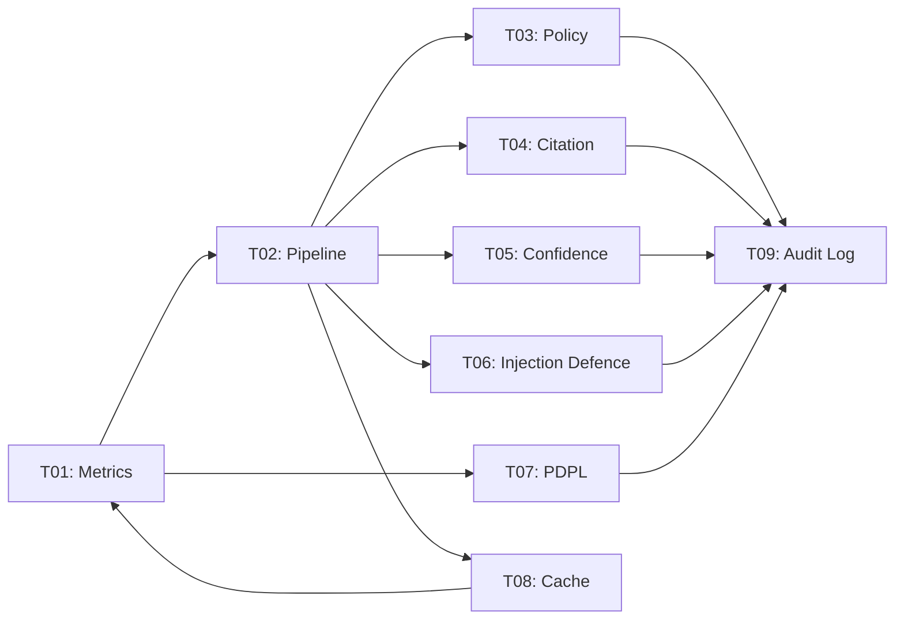

# Phase 02 Audit Summary — Core Engine

> **Audit Date**: 2026-05-02
> **Phase Status**: `in_progress` | **Estimated Completion**: ~16%
> **Total Tasks**: 9 (P02-T01 through P02-T09)
> **Verdict**: ⚠️ Phase 2 has significantly more code scaffolded than Phase 1 (~2,016 lines of TypeScript across 9 modules + ~459 lines of documentation). Every FR has at least one skeleton file. But every FR also fails the vast majority of its Acceptance Criteria. Zero tests exist across all 9 tasks. No Postgres tables deployed. No integrations wired. The code layer is a well-structured set of skeletons awaiting the operational layer.

---

## Aggregate Scorecard

| Task | FR Title | Code Files | Doc Files | AC Pass/Total | Tests | Completion |
|------|----------|-----------|-----------|---------------|-------|------------|
| P02-T01 | Semantic Metric Layer | `registry.ts` (271 lines) | 3 docs (106 lines) | 0/10 | 0 | ~20% |
| P02-T02 | NL→SQL Pipeline | `pipeline.ts` (448 lines) | 1 doc (67 lines) | 0/9 | 0 | ~25% |
| P02-T03 | Policy Layer | `policy-engine.ts` (286 lines) | 1 doc (35 lines) | 0/9 | 0 | ~15% |
| P02-T04 | Citation Engine | `citation-engine.ts` (221 lines) | 0 docs | 0/8 | 0 | ~10% |
| P02-T05 | Confidence-Tier Scoring | `scoring.ts` (168 lines) | 1 doc (87 lines) | 0/8 | 0 | ~20% |
| P02-T06 | Prompt-Injection Defence | `prompt-guard.ts` (199 lines) | 2 docs (108 lines) | 0/8 | 0 | ~20% |
| P02-T07 | PDPL Consent & Minimisation | `consent-ledger.ts` (100 lines) | 1 doc (40 lines) | 0/8 | 0 | ~10% |
| P02-T08 | Two-Tier Cache | `two-tier-cache.ts` (138 lines) | 1 doc (50 lines) | 0/8 | 0 | ~15% |
| P02-T09 | Audit Log | `audit-log.ts` (136 lines) | 1 doc (53 lines) | 0/10 | 0 | ~10% |

### Phase 2 Totals

| Category | Count |
|----------|-------|
| **Acceptance Criteria PASS** | 0 / 78 |
| **Acceptance Criteria PARTIAL** | 12 / 78 |
| **Acceptance Criteria FAIL** | 66 / 78 |
| **Test Plans Executed** | 0 / 75 |
| **Success Metrics Met** | 0 / 9 |
| **Total Code Lines** | ~1,967 lines across 9 .ts files |
| **Total Doc Lines** | ~546 lines across 10 .md/.yaml files |
| **Total Test Files** | 0 |
| **Total Tests** | 0 (target: ~1,100 across all FRs) |

---

## Key Findings

### What Exists (Strengths)

1. **Every FR has a code skeleton.** Unlike Phase 1 (which has mostly documentation), Phase 2 has substantial TypeScript code for every module. The NL→SQL pipeline alone is 448 lines.
2. **Documentation quality is high.** `FORMULA.md` (87 lines for confidence scoring), `KEY_SCHEMA.md` (50 lines for caching), and `SCHEMA.md` (59 lines for metrics) are well-structured reference docs.
3. **Architecture is consistent.** The 9 modules follow a clear `engine/{domain}/` directory pattern. File naming is consistent.
4. **System-prompt template is well-crafted.** `system-prompt.md` (67 lines) with `<untrusted_content>` isolation pattern is a proper security convention.

### What's Missing (Critical Gaps)

1. **Zero tests.** All 9 FRs collectively require ~1,100 tests. Zero exist. This is the single largest gap.
2. **No Postgres tables.** Every FR that stores data (T01 registry, T07 consent ledger, T09 audit log) has no migration file. No Prisma schema. No deployed database.
3. **No integrations wired.** Each FR depends on 2–5 other FRs. None of the cross-FR wiring exists:
   - Pipeline → Policy → Confidence → Citation chain is unlinked.
   - Audit log is referenced by T01–T08 but not consumed.
   - HITL routing (P06) is called by T03 and T05 but P06 doesn't exist.
4. **No observability.** No OpenTelemetry spans, counters, or histograms across any module.
5. **No admin APIs.** Every FR specifies admin UI backend endpoints. None exist.
6. **No compliance documents.** PDPL conformance doc and Cybersecurity Law mapping (T07) are missing.
7. **No adversarial corpus.** T06 requires 200+ adversarial entries. Zero exist.
8. **No WORM mirror.** T09's regulatory artefact (7-year retention) is unimplemented.

---

## Dependency Chain Status

The Phase 2 dependency graph is tightly coupled:

**Critical path**: T01 (Metric Layer) → T02 (Pipeline) → T03/T04/T05/T06 → T09 (Audit Log)

**Blocking dependency**: T01 must be operational before T02 can function (pipeline needs metrics to retrieve). T09 must be operational before any FR can log audit events.

---

## Comparison with Phase 1

| Dimension | Phase 1 | Phase 2 |
|-----------|---------|---------|
| Tasks | 10 | 9 |
| Code files | ~4 | 9 |
| Total code lines | ~300 | ~1,967 |
| Doc files | ~15 | ~10 |
| AC Pass rate | 0% | 0% |
| AC Partial rate | 15% | 15% |
| Tests | 0 | 0 |
| Estimated completion | ~18% | ~16% |
| Primary gap | Infrastructure (IaC, CI/CD, deploy) | Operational layer (integrations, tests, data) |

**Interpretation**: Phase 2 has more raw code but less operational readiness. Phase 1's gap is "nothing is deployed"; Phase 2's gap is "nothing is tested or integrated."

---

## Remediation Priority

| Priority | Task | Rationale |
|----------|------|-----------|
| **P0** | T09 Audit Log | Every other FR depends on it for compliance logging. |
| **P0** | T01 Metric Layer | Pipeline, policy, confidence, cache all depend on the registry. |
| **P0** | T02 Pipeline | The core product feature; all user-facing value flows through it. |
| **P1** | T03 Policy Layer | Governance gate; blocks compliance posture. |
| **P1** | T05 Confidence Scoring | User trust signal; blocks policy-layer HITL trigger. |
| **P1** | T06 Injection Defence | Security; blocks adversarial testing. |
| **P1** | T04 Citation Engine | Trust drawer; blocks user-facing trust signal. |
| **P2** | T07 PDPL | Compliance; critical for commercialisation but not for PoC demo. |
| **P2** | T08 Cache | Performance; non-functional requirement. |

---

## Recommendations

1. **Start with T09 (Audit Log) and T01 (Metric Layer)** — they are the two foundational services. Every other FR consumes them.
2. **Write tests from day one.** Require 80%+ coverage before marking any subtask complete. The test debt across 9 FRs is the largest risk.
3. **Decompose T02's 448-line monolith.** The pipeline needs modular stages for testability and for wiring P02-T03/T04/T05/T06.
4. **Create integration test harness.** A single `integration-test.ts` that wires T01→T02→T03→T04→T05→T09 end-to-end with a sample question.
5. **Block Phase 3+ until Phase 2 integration test passes.** Phase 2 is the engine; if the engine doesn't work end-to-end, nothing downstream matters.
