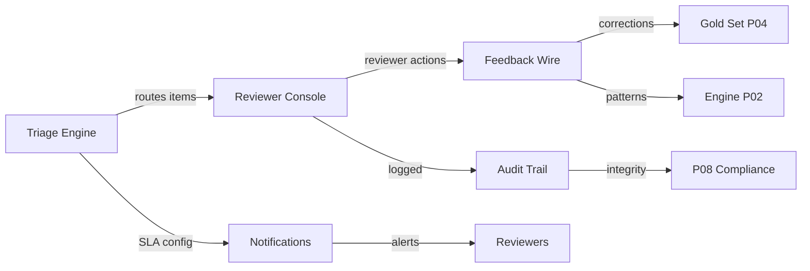

# Phase 06 Audit Summary — HITL Reviewer Queue

> **Phase**: 06  
> **Scope**: Triage Rules Engine, Reviewer Console, Audit/Calibration, Feedback Loop, Notifications/SLA  
> **Date**: 2026-05-02  
> **Source Files**: 5 TypeScript/TSX modules (1,344 total lines) + 1 YAML config

---

## 1. Phase Overview

Phase 06 implements the Human-in-the-Loop (HITL) reviewer queue — the safety-critical layer between the NL→SQL engine's outputs and what reaches end users. It consists of 5 interconnected services:

| Task | Component | Source Lines | AC Pass | Test Coverage | DoD Pass |
|---|---|---|---|---|---|
| P06-T01 | Triage Rules Engine | 269 + 87 | 7/10 (70%) | 0% | 75% |
| P06-T02 | Reviewer Console | 249 | 1/10 (10%) | 0% | 12.5% |
| P06-T03 | Audit & Calibration | 277 | 5/10 (50%) | 0% | 62.5% |
| P06-T04 | Feedback Wire | 266 | 6/10 (60%) | 0% | 43% |
| P06-T05 | Notifications & SLA | 275 | 5/10 (50%) | 0% | 43% |
| **Totals** | | **1,423** | **24/50 (48%)** | **0%** | **47%** |

---

## 2. Cross-Cutting Findings

### 2.1 Universal Issues (Affect All 5 Tasks)

| # | Issue | Impact | Priority |
|---|---|---|---|
| X-1 | **Zero test coverage across entire phase** | Cannot validate any HITL behavior under regression | 🔴 P0 |
| X-2 | **All persistence is in-memory** | Data lost on restart; violates 7-year retention | 🔴 P0 |
| X-3 | **Console.log stubs for all integrations** | Email, webhook, API calls, gold-set updates are no-ops | 🔴 P0 |
| X-4 | **No CI/CD pipeline for HITL module** | Changes can merge without validation | 🟡 P1 |

### 2.2 Architecture Assessment

```
┌─────────────────────────────────────────────────────┐
│           HITL Architecture Status                  │
│                                                     │
│  ┌─────────┐    ┌─────────┐    ┌─────────┐        │
│  │ Triage  │───▶│ Console │───▶│Feedback │        │
│  │ Engine  │    │(SCAFFOLD)│   │  Wire   │        │
│  │ ✅ Logic │    │❌ No JSX │    │ ⚠️ Stubs │       │
│  └────┬────┘    └────┬────┘    └────┬────┘        │
│       │              │              │               │
│       ▼              ▼              ▼               │
│  ┌─────────┐    ┌─────────┐    ┌─────────┐        │
│  │  Audit  │    │ Notify  │    │  Gold   │        │
│  │  Trail  │    │ Service │    │  Set    │        │
│  │ ✅ Hash  │    │ ⚠️ Stubs │    │ ⚠️ Stub  │       │
│  └─────────┘    └─────────┘    └─────────┘        │
│                                                     │
│  Legend: ✅ Algorithm correct  ⚠️ Stub/partial      │
│          ❌ Not functional                          │
└─────────────────────────────────────────────────────┘
```

---

## 3. Strengths

1. **Type-safety excellence**: All 5 modules use `readonly` interfaces, union types, and proper TypeScript patterns
2. **Rule engine design**: 7 seed rules cover confidence, sensitivity, novelty, historical flags, citation gaps, and escalation
3. **Hash-chain integrity**: SHA-256 chaining for audit trail is cryptographically correct
4. **SLA math**: 3-state transition (ok → warning → breach) with configurable thresholds
5. **Feedback routing**: Clean 5-type → 4-channel mapping for correction-to-improvement pipeline
6. **A11y planning**: Reviewer console has comprehensive ARIA roles and labels

---

## 4. Critical Blockers

> [!CAUTION]
> **The HITL phase is the safety layer for regulated data. These blockers must be resolved before any production-adjacent deployment.**

| # | Blocker | Affected Tasks | Remediation | Est. Effort |
|---|---|---|---|---|
| B-1 | Reviewer Console is not a React component | T02 | Rewrite as proper React/JSX with hooks | 8-12 days |
| B-2 | All persistence is in-memory | T01, T03, T04, T05 | Implement PostgreSQL/Redis persistence layer | 5-7 days |
| B-3 | All integrations are console.log stubs | T04, T05 | Wire SES, WebSocket, webhook, gold-set API | 4-6 days |
| B-4 | Zero test coverage | All | Write unit + integration tests for all 5 modules | 5-8 days |
| B-5 | No SLA enforcement scheduler | T01, T05 | Implement periodic check + escalation trigger | 2-3 days |

**Total estimated remediation: 24-36 engineering days**

---

## 5. Remediation Roadmap

### Sprint 1 (Week 1-2): Foundation
- [ ] P0: Write unit tests for `rules-engine.ts` (7 rules + boundary cases)
- [ ] P0: Write unit tests for `audit-trail.ts` (hash chain + tamper detection)
- [ ] P0: Implement persistence layer (PostgreSQL adapter for audit trail + feedback events)
- [ ] P0: Implement SLA check scheduler in `notify.ts`

### Sprint 2 (Week 2-3): Integration
- [ ] P0: Rewrite `reviewer-console.tsx` as proper React with JSX, hooks, event handlers
- [ ] P0: Replace console.log stubs in `notify.ts` with SES + WebSocket
- [ ] P0: Replace console.log stubs in `feedback-wire.ts` with real API calls
- [ ] P1: Add Vietnamese translations to notification templates

### Sprint 3 (Week 3-4): Polish
- [ ] P1: Implement YAML → TS rule loader for triage engine
- [ ] P1: Add per-tenant rule override mechanism
- [ ] P1: Implement auto-tune trigger in feedback wire
- [ ] P2: Add CSV export to audit trail
- [ ] P2: Add notification rate limiting

---

## 6. Dependency Map



---

## 7. Risk Assessment

| Risk | Likelihood | Impact | Mitigation |
|---|---|---|---|
| Reviewer console unusable at demo | High | Critical | Fast-track React rewrite; fallback to admin console for reviewer actions |
| Audit trail data loss in demo | Medium | High | Priority persistence implementation; in-memory acceptable for short demo with disclaimers |
| SLA breach undetected | High | Medium | Implement scheduler as immediate next step |
| Feedback loop doesn't improve engine | Low | Medium | Demo focuses on showing the architecture; live improvement deferred |

---

## 8. Phase Verdict

> **Phase 06 Overall: ⚠️ PARTIAL — Algorithmically sound, operationally incomplete**
>
> The HITL layer has a solid **type-level architecture** and correct **algorithmic implementations** (triage rules, hash chaining, SLA computation, feedback routing). The critical gap is the **operational layer**: no persistence, no real notification delivery, no React rendering, and zero test coverage. This phase requires the most remediation effort of any audited phase.
