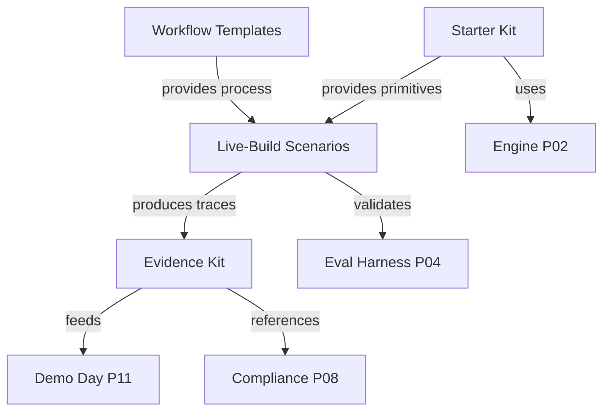

# Phase 07 Audit Summary — Demo Day Dry-Run

> **Phase**: 07  
> **Scope**: Vibe-Coding Starter Kit, Live-Build Scenarios, Workflow Templates, Evidence Kit  
> **Date**: 2026-05-02  
> **Source Files**: 1 TypeScript module (178 lines) + 1 TS library (148 lines) + 3 presets (86 lines) + 2 Markdown docs (180 lines)

---

## 1. Phase Overview

Phase 07 prepares the Demo Day infrastructure: a forkable starter kit, live-build scenarios with kill/graduation criteria, workflow templates, and evidence of system discipline. This phase bridges the engineering work (P01-P06) with the commercial demonstration.

| Task | Component | Artifact Size | AC Pass | Test Coverage | DoD Pass |
|---|---|---|---|---|---|
| P07-T01 | Starter Kit | 148+70+86 lines | 7/11 (64%) | 0% | 43% |
| P07-T02 | Live-Build Scenarios | 178 lines | 5/10 (50%) | 0% | 50% |
| P07-T03 | Workflow Templates | 0 lines (FR only) | 0/7 (0%) | 0% | 0% |
| P07-T04 | Evidence Kit | 110 lines | 0/10 (0%) | 0% | 14% |
| **Totals** | | **~592 lines** | **12/38 (32%)** | **0%** | **27%** |

---

## 2. Cross-Cutting Findings

### 2.1 Phase Architecture

```
┌────────────────────────────────────────────────────────┐
│              Phase 07 — Demo Day Pipeline              │
│                                                        │
│  ┌─────────┐    ┌──────────┐    ┌──────────┐         │
│  │ Starter │───▶│ Scenarios │───▶│ Evidence │         │
│  │   Kit   │    │ (3 builds)│    │   Kit    │         │
│  │ ✅ Types │    │ ✅ Config  │    │ ⚠️ Empty  │         │
│  │ ❌ Pkg   │    │ ❌ Runner  │    │          │         │
│  └─────────┘    └──────────┘    └──────────┘         │
│                       │                                │
│                  ┌────▼────┐                           │
│                  │Templates│                           │
│                  │ ❌ None  │                           │
│                  └─────────┘                           │
│                                                        │
│  Pipeline Flow:                                        │
│  Kit → Scenario Config → Runner → Build Trace →       │
│  Kill/Graduate → Evidence → Stakeholder One-Pager     │
│                                                        │
│  Current State: Config layer complete, execution gap   │
└────────────────────────────────────────────────────────┘
```

### 2.2 Universal Issues

| # | Issue | Impact | Priority |
|---|---|---|---|
| X-1 | **Zero test coverage across entire phase** | Cannot validate financial math or scenario configs | 🔴 P0 |
| X-2 | **No execution infrastructure** | Scenarios can't run; evidence can't populate | 🔴 P0 |
| X-3 | **Workflow templates not created** | No standardized process for demo cycles | 🟡 P1 |
| X-4 | **No fallback recordings** | Demo Day failure risk unmitigated | 🔴 P0 |

---

## 3. Strengths

1. **Financial primitives quality**: `bigint`-based VND math, proper locale formatting, standard risk metrics (Sharpe, VaR, Max Drawdown)
2. **Scenario specification depth**: Each scenario has 12+ fields with measurable kill/graduation criteria
3. **Preset system**: 3 BU-specific presets with domain context and compliance notes
4. **Evidence framework**: The kit document correctly describes the discipline philosophy and 50% kill rate as a feature

---

## 4. Critical Blockers

> [!WARNING]
> **Phase 07 has a serial dependency chain: Kit packaging → Scenario runner → Evidence population. The entire chain is blocked at step 1.**

| # | Blocker | Downstream Impact | Remediation | Est. Effort |
|---|---|---|---|---|
| B-1 | Starter kit not a runnable package | Cannot fork and run | Add `package.json`, `docker-compose.yml`, MCP config | 2-3 days |
| B-2 | No scenario execution runner | Cannot execute live builds | Build `runScenario()` orchestrator | 3-5 days |
| B-3 | No fallback recordings | Demo Day has no safety net | Record 3 pre-built walkthrough videos | 2-3 days |
| B-4 | Workflow templates not started | No structured process | Author 5 template documents | 1-2 days |
| B-5 | Evidence kit has no data | Discipline claims are unsubstantiated | Run ≥ 1 cycle; capture metrics | 2-3 days (after B-2) |

**Total estimated remediation: 10-16 engineering days**

---

## 5. Remediation Roadmap

### Sprint 1 (Week 1): Packaging & Templates
- [ ] P0: Create `package.json` for starter kit with TypeScript, build scripts
- [ ] P0: Create `docker-compose.yml` for local demo bootstrap
- [ ] P0: Create MCP configuration file (`.mcp.json`)
- [ ] P1: Author 5 workflow templates (spec, demo, gate, cadence, retro)
- [ ] P0: Write unit tests for `financial-types.ts` (VND, P&L, risk metrics)

### Sprint 2 (Week 2): Execution
- [ ] P0: Build scenario execution runner with MCP integration
- [ ] P0: Record 3 fallback video walkthroughs
- [ ] P1: Implement kill/graduation criteria evaluation function
- [ ] P1: Implement build trace capture

### Sprint 3 (Week 3): Evidence
- [ ] P0: Execute ≥ 1 cycle of all 3 scenarios
- [ ] P0: Populate evidence kit with real cycle data
- [ ] P1: Create stakeholder one-pager with quantitative metrics
- [ ] P1: Export audit log samples as compliance evidence

---

## 6. Dependency Map



---

## 7. Risk Assessment

| Risk | Likelihood | Impact | Mitigation |
|---|---|---|---|
| Demo Day with no execution runner | High | Critical | Fast-track runner; prepare manual walkthrough as backup |
| Financial math errors in demo | Low | High | Prioritize `financial-types.ts` unit tests |
| No evidence of discipline | Medium | High | Run at least 1 internal cycle before Demo Day |
| Workflow templates missing | Medium | Medium | Templates are doc-only; author quickly |
| Fallback recordings unavailable | High | Critical | Record within Sprint 2; test playback |

---

## 8. Phase Verdict

> **Phase 07 Overall: ⚠️ PARTIAL — Configuration layer complete, execution layer absent**
>
> Phase 07 has a well-designed **specification layer**: financial primitives are production-quality, scenarios are thoroughly specified, and the evidence framework is architecturally sound. The critical gap is the **execution layer**: the starter kit isn't packaged, scenarios can't run, no recordings exist, and the evidence kit has no data. This phase requires a sequential remediation approach (kit → runner → evidence) with an estimated 10-16 engineering days.
