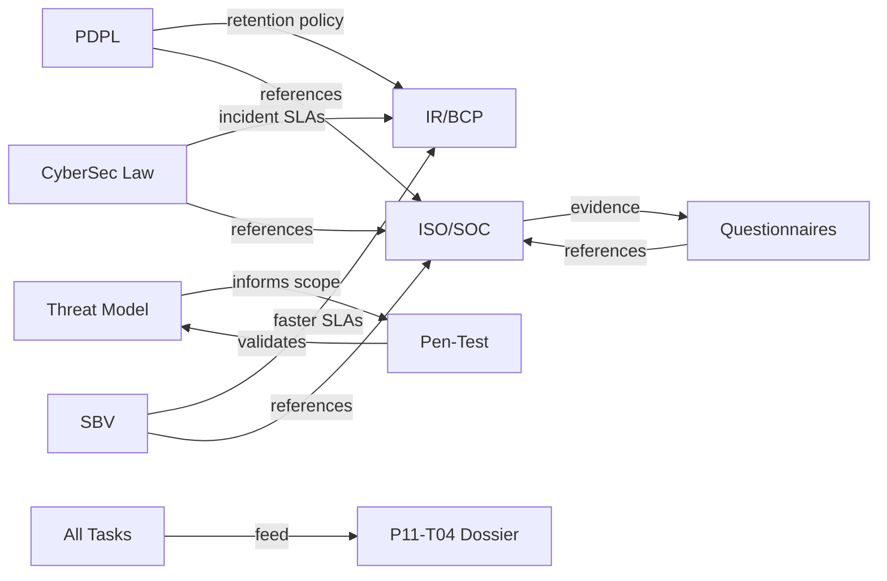

# Phase 08 Audit Summary — Compliance & Security

> **Phase**: 08  
> **Scope**: PDPL, Cybersecurity Law, SBV Regulations, ISO/SOC, Threat Model, Pen-Test, Vendor Questionnaires, IR/BCP  
> **Date**: 2026-05-02  
> **Source Files**: 8 compliance documents (968 total lines)

---

## 1. Phase Overview

Phase 08 is the compliance and security dossier — the foundation for Shinhan procurement readiness. It spans 3 VN regulatory frameworks, 3 international standards, security validation, vendor readiness, and incident preparedness.

| Task | Component | Source Lines | AC Pass | Test Pass | DoD Pass |
|---|---|---|---|---|---|
| P08-T01 | PDPL Conformance | 121 | 8/10 (80%) | 2/5 (40%) | 67% |
| P08-T02 | VN Cybersecurity Law | 86 | 5/10 (50%) | 1/4 (25%) | 0% |
| P08-T03 | SBV Regulatory Mapping | 80 | 4/10 (40%) | 1/4 (25%) | 0% |
| P08-T04 | ISO/SOC Readiness | 122 | 4/10 (40%) | 0/5 (0%) | 29% |
| P08-T05 | Threat Model | 137 | 6/10 (60%) | 3/6 (50%) | 50% |
| P08-T06 | Pen-Test Procurement | 114 | 4/12 (33%) | 0/7 (0%) | — |
| P08-T07 | Vendor Questionnaires | 92 | 0/7 (0%) | 0/4 (0%) | 0% |
| P08-T08 | IR/BCP Runbooks | 158 | 4/10 (40%) | 0/5 (0%) | 25% |
| **Totals** | | **910** | **35/79 (44%)** | **7/40 (18%)** | **21%** |

---

## 2. Cross-Cutting Findings

### 2.1 Universal Issues

| # | Issue | Affected Tasks | Priority |
|---|---|---|---|
| X-1 | **No quarterly review scheduled for any compliance document** | All 8 | 🔴 P0 |
| X-2 | **No squad briefings completed** | T02, T03, T04, T05, T08 | 🟡 P1 |
| X-3 | **Supporting documents missing** (uncertainty logs, per-class playbooks, cross-mappings) | T02, T03, T04, T08 | 🟡 P1 |
| X-4 | **DPO / cybersecurity officer not named** (role defined, person TBD) | T01, T02 | 🟡 P1 |

### 2.2 Compliance Maturity Matrix

| Dimension | PDPL | CyberSec Law | SBV | ISO/SOC | Threat Model |
|---|---|---|---|---|---|
| Obligation Mapping | ✅ Complete | ✅ Core | ✅ Core | ⚠️ Partial | ✅ Complete |
| Evidence Pointers | ✅ Present | ⚠️ Partial | ✅ Present | ✅ Present | ✅ Present |
| Gap Statements | ✅ Present | ❌ Missing | ❌ Missing | ⚠️ Partial | N/A |
| Quarterly Review | ❌ Missing | ❌ Missing | ❌ Missing | ❌ Missing | ❌ Missing |
| Cross-References | ⚠️ Partial | ⚠️ Partial | ⚠️ Partial | ❌ Missing | ✅ Present |

---

## 3. Strengths

1. **PDPL mapping is production-quality**: Legally precise, operationally actionable with SLAs, DPIA completed
2. **Threat model is comprehensive**: 25 threats across 7 services + 8 LLM-specific with mitigations and residual risk register
3. **ISO 42001 is a differentiator**: Complete AI management system mapping — unique for VN startups
4. **SBV AI-specific section**: Proactively maps regulator expectations for explainability, oversight, bias
5. **IR/BCP master plans**: Industry-standard 5-phase IR + 5-scenario BCP with correct regulatory SLAs
6. **Pen-test scope is threat-model-informed**: In-scope components aligned with STRIDE analysis
7. **Vendor questionnaires**: Shinhan-specific section anticipates 10 likely questions with substantive answers

---

## 4. Critical Blockers

> [!WARNING]
> **Phase 08 is the compliance foundation for Shinhan procurement. These blockers must be resolved before the client kickoff.**

| # | Blocker | Impact | Remediation | Est. Effort |
|---|---|---|---|---|
| B-1 | ISO 27001 only 20/93 controls mapped | Procurement team rejects as incomplete | Complete remaining 73 Annex A controls | 5-7 days |
| B-2 | SIG Lite + CAIQ questionnaires < 15% complete | Cannot respond to procurement requests | Complete full questionnaire sets | 7-10 days |
| B-3 | 8 per-incident-class playbooks missing | IR response is generic during incidents | Author all 8 playbooks | 3-5 days |
| B-4 | No quarterly review scheduled for any document | Compliance drift risk | Create unified review calendar | 1 day |
| B-5 | Pen-test not started (vendors TBD) | No external security validation | Begin vendor procurement immediately | 28 days |

**Total estimated remediation: 44-51 days (note: pen-test runs in parallel)**

---

## 5. Remediation Roadmap

### Sprint 1 (Week 1-2): Regulatory Completeness
- [ ] P0: Create quarterly review calendar (single action, covers all 8 tasks)
- [ ] P0: Complete ISO 27001 remaining 73 Annex A controls
- [ ] P0: Create uncertainty log for Cybersecurity Law (`UNCERTAINTY.md`)
- [ ] P1: Create SBV supporting docs (on-prem tie-in, audit-trail mapping, incident runbook)
- [ ] P1: Create ISO cross-mapping document
- [ ] P1: Designate DPO and cybersecurity officer by name

### Sprint 2 (Week 2-3): Vendor & Procurement Readiness
- [ ] P0: Complete SIG Lite questionnaire (remaining ~122 questions)
- [ ] P0: Complete CAIQ questionnaire (remaining ~245 questions)
- [ ] P0: Begin pen-test vendor procurement (identify 3 vendors)
- [ ] P1: Create evidence library cross-reference for questionnaires
- [ ] P1: Fill company profile TBD fields

### Sprint 3 (Week 3-4): IR/BCP & Operational Readiness
- [ ] P0: Author 8 per-incident-class playbooks
- [ ] P0: Author 4 remaining communication templates (customer, PDPL, SBV, SBV-Bank)
- [ ] P1: Create PIR (blameless postmortem) template
- [ ] P1: Set up on-call rotation (PagerDuty/Grafana OnCall)
- [ ] P1: Fill contact list with actual people
- [ ] P1: Schedule first table-top exercise

### Sprint 4 (Week 4-5): Briefings & Polish
- [ ] P1: Conduct 5 squad briefings (PDPL, CyberSec Law, SBV, ISO/SOC, Threat Model)
- [ ] P1: Add 2 missing OWASP LLM items to threat model
- [ ] P1: Add banking-specific threat section
- [ ] P2: Number all threats (T-001..T-025) in threat model
- [ ] P2: Create per-standard readiness rollup for ISO 27001/42001

---

## 6. Dependency Map

---

## 7. Risk Assessment

| Risk | Likelihood | Impact | Mitigation |
|---|---|---|---|
| Shinhan procurement requests full SIG Lite | High | Critical | Complete fill-in is Sprint 2 priority |
| ISO 27001 gaps noticed by procurement | High | High | Fast-track Annex A completion |
| Incident with no per-class playbook | Medium | High | Master runbook usable as generic fallback |
| Quarterly review not started | High | Medium | Calendar creation is 1-day effort; schedule immediately |
| Pen-test not done before Demo Day | Medium | High | Start procurement immediately; fallback: internal security review |
| DPO not named during regulatory inquiry | Low | High | Interim designation (CTO) documented; permanent designation fast-tracked |

---

## 8. Tier Ranking (Tasks by Maturity)

| Tier | Tasks | Status | Key Gap |
|---|---|---|---|
| **Tier 1 — Substantially Complete** | T01 (PDPL), T05 (Threat Model) | ✅ Core complete | Quarterly review + minor additions |
| **Tier 2 — Partial** | T02 (CyberSec Law), T03 (SBV), T06 (Pen-Test), T08 (IR/BCP) | ⚠️ Core present, supporting docs missing | Supporting documents + playbooks |
| **Tier 3 — Incomplete** | T04 (ISO/SOC), T07 (Questionnaires) | ❌ Major gaps | ISO 27001 completion, full questionnaire fill |

---

## 9. Phase Verdict

> **Phase 08 Overall: ⚠️ PARTIAL — Strong foundation with significant completeness gaps**
>
> Phase 08 demonstrates genuine compliance thinking: the PDPL mapping, threat model, and ISO 42001 sections are differentiated, legally precise artifacts that would impress Shinhan procurement. The challenge is **coverage breadth**: ISO 27001 is 22% mapped, vendor questionnaires are <15% complete, and IR playbooks are generic rather than incident-specific. This phase requires the most calendar time (pen-test procurement alone is 28 days) but much of the remaining work is documentation authoring, not engineering.
